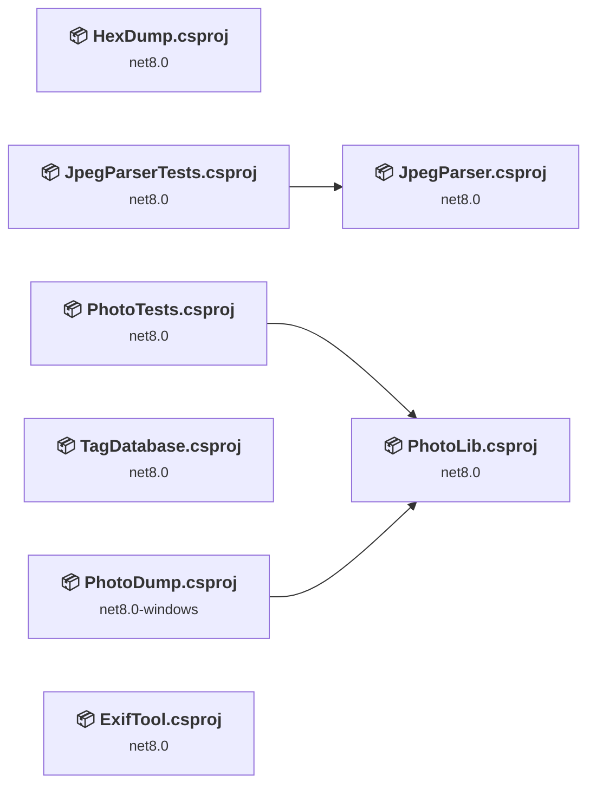
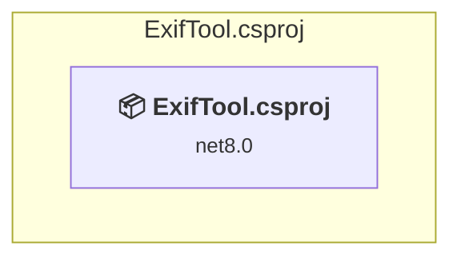
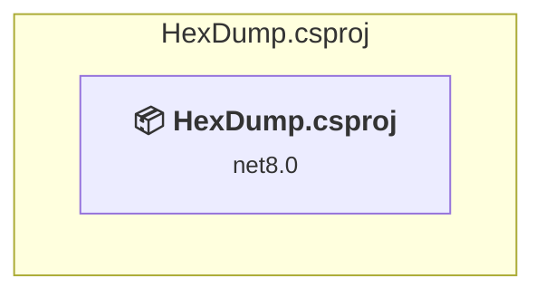
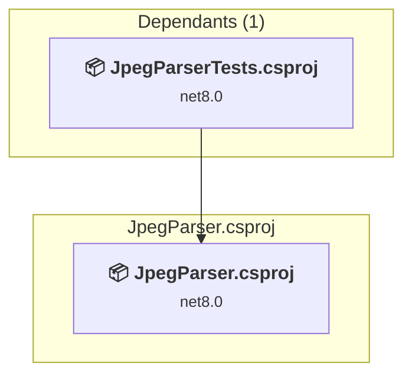
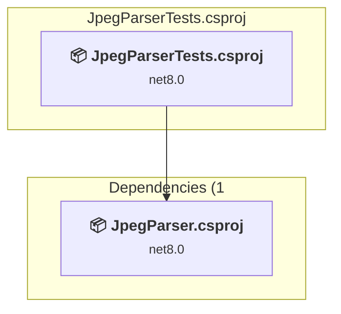
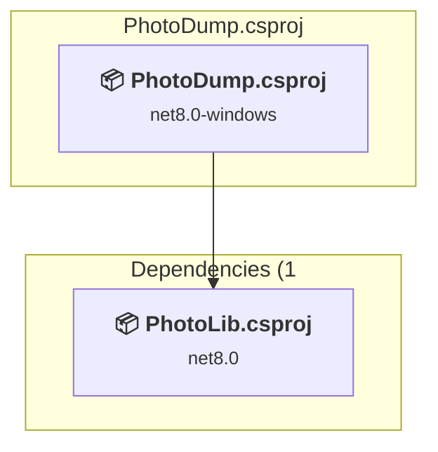
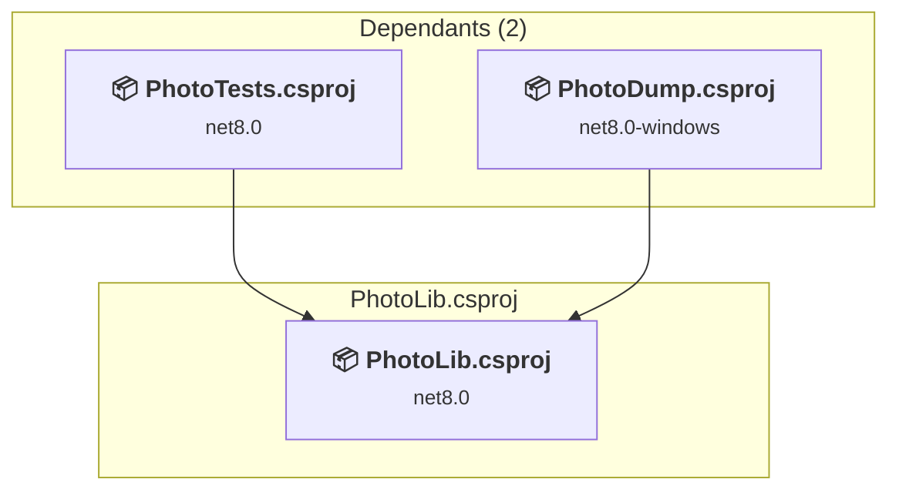
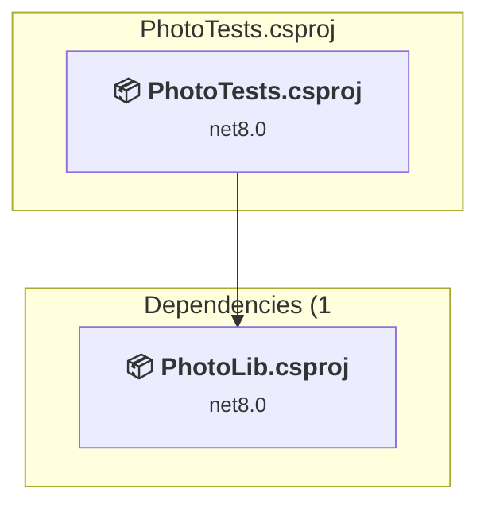
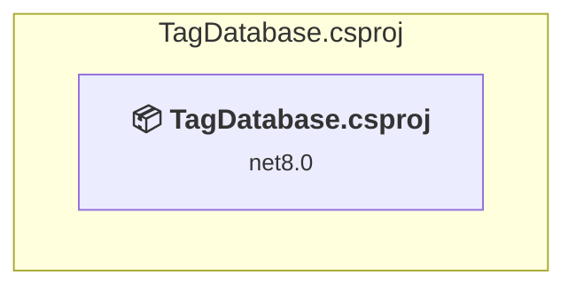

# Projects and dependencies analysis

This document provides a comprehensive overview of the projects and their dependencies in the context of upgrading to .NETCoreApp,Version=v10.0.

## Table of Contents

- [Executive Summary](#executive-Summary)
  - [Highlevel Metrics](#highlevel-metrics)
  - [Projects Compatibility](#projects-compatibility)
  - [Package Compatibility](#package-compatibility)
  - [API Compatibility](#api-compatibility)
  - [Binding Redirect Configuration](#binding-redirect-configuration)
- [Aggregate NuGet packages details](#aggregate-nuget-packages-details)
- [Top API Migration Challenges](#top-api-migration-challenges)
  - [Technologies and Features](#technologies-and-features)
  - [Most Frequent API Issues](#most-frequent-api-issues)
- [Projects Relationship Graph](#projects-relationship-graph)
- [Project Details](#project-details)

  - [ExifTool\ExifTool.csproj](#exiftoolexiftoolcsproj)
  - [HexDump\HexDump.csproj](#hexdumphexdumpcsproj)
  - [JpegParser\JpegParser.csproj](#jpegparserjpegparsercsproj)
  - [JpegParserTests\JpegParserTests.csproj](#jpegparsertestsjpegparsertestscsproj)
  - [PhotoDump\PhotoDump.csproj](#photodumpphotodumpcsproj)
  - [PhotoLib\PhotoLib.csproj](#photolibphotolibcsproj)
  - [PhotoTests\PhotoTests.csproj](#phototestsphototestscsproj)
  - [TagDatabase\TagDatabase.csproj](#tagdatabasetagdatabasecsproj)

## Executive Summary

### Highlevel Metrics

| Metric | Count | Status |
| :--- | :---: | :--- |
| Total Projects | 8 | All require upgrade |
| Total NuGet Packages | 21 | All compatible |
| Total Code Files | 138 |  |
| Total Code Files with Incidents | 12 |  |
| Total Lines of Code | 20122 |  |
| Total Number of Issues | 25 |  |
| Estimated LOC to modify | 17+ | at least 0.1% of codebase |

### Projects Compatibility

| Project | Target Framework | Difficulty | Package Issues | API Issues | Binding Issues | Est. LOC Impact | Description |
| :--- | :---: | :---: | :---: | :---: | :---: | :---: | :--- |
| [ExifTool\ExifTool.csproj](#exiftoolexiftoolcsproj) | net8.0 | 🟢 Low | 0 | 0 | 0 |  | DotNetCoreApp, Sdk Style = True |
| [HexDump\HexDump.csproj](#hexdumphexdumpcsproj) | net8.0 | 🟢 Low | 0 | 0 | 0 |  | DotNetCoreApp, Sdk Style = True |
| [JpegParser\JpegParser.csproj](#jpegparserjpegparsercsproj) | net8.0 | 🟢 Low | 0 | 0 | 0 |  | ClassLibrary, Sdk Style = True |
| [JpegParserTests\JpegParserTests.csproj](#jpegparsertestsjpegparsertestscsproj) | net8.0 | 🟢 Low | 0 | 0 | 0 |  | DotNetCoreApp, Sdk Style = True |
| [PhotoDump\PhotoDump.csproj](#photodumpphotodumpcsproj) | net8.0-windows | 🟢 Low | 0 | 17 | 0 | 17+ | Wpf, Sdk Style = True |
| [PhotoLib\PhotoLib.csproj](#photolibphotolibcsproj) | net8.0 | 🟢 Low | 0 | 0 | 0 |  | ClassLibrary, Sdk Style = True |
| [PhotoTests\PhotoTests.csproj](#phototestsphototestscsproj) | net8.0 | 🟢 Low | 0 | 0 | 0 |  | DotNetCoreApp, Sdk Style = True |
| [TagDatabase\TagDatabase.csproj](#tagdatabasetagdatabasecsproj) | net8.0 | 🟢 Low | 0 | 0 | 0 |  | DotNetCoreApp, Sdk Style = True |

### Package Compatibility

| Status | Count | Percentage |
| :--- | :---: | :---: |
| ✅ Compatible | 21 | 100.0% |
| ⚠️ Incompatible | 0 | 0.0% |
| 🔄 Upgrade Recommended | 0 | 0.0% |
| ***Total NuGet Packages*** | ***21*** | ***100%*** |

### API Compatibility

| Category | Count | Impact |
| :--- | :---: | :--- |
| 🔴 Binary Incompatible | 12 | High - Require code changes |
| 🟡 Source Incompatible | 0 | Medium - Needs re-compilation and potential conflicting API error fixing |
| 🔵 Behavioral change | 5 | Low - Behavioral changes that may require testing at runtime |
| ✅ Compatible | 24603 |  |
| ***Total APIs Analyzed*** | ***24620*** |  |

## Aggregate NuGet packages details

| Package | Current Version | Suggested Version | Projects | Description |
| :--- | :---: | :---: | :--- | :--- |
| coverlet.collector | 6.0.4 |  | [JpegParserTests.csproj](#jpegparsertestsjpegparsertestscsproj) [PhotoTests.csproj](#phototestsphototestscsproj) | ✅Compatible |
| Microsoft.Bcl.AsyncInterfaces | 6.0.0 |  | [JpegParserTests.csproj](#jpegparsertestsjpegparsertestscsproj) [PhotoTests.csproj](#phototestsphototestscsproj) | ✅Compatible |
| Microsoft.CodeCoverage | 17.14.0 |  | [JpegParserTests.csproj](#jpegparsertestsjpegparsertestscsproj) [PhotoTests.csproj](#phototestsphototestscsproj) | ✅Compatible |
| Microsoft.NET.Test.Sdk | 17.14.0 |  | [JpegParserTests.csproj](#jpegparsertestsjpegparsertestscsproj) [PhotoTests.csproj](#phototestsphototestscsproj) | ✅Compatible |
| Microsoft.Testing.Extensions.TrxReport.Abstractions | 1.6.3 |  | [JpegParserTests.csproj](#jpegparsertestsjpegparsertestscsproj) [PhotoTests.csproj](#phototestsphototestscsproj) | ✅Compatible |
| Microsoft.Testing.Platform | 1.6.3 |  | [JpegParserTests.csproj](#jpegparsertestsjpegparsertestscsproj) [PhotoTests.csproj](#phototestsphototestscsproj) | ✅Compatible |
| Microsoft.Testing.Platform.MSBuild | 1.6.3 |  | [JpegParserTests.csproj](#jpegparsertestsjpegparsertestscsproj) [PhotoTests.csproj](#phototestsphototestscsproj) | ✅Compatible |
| Microsoft.TestPlatform.ObjectModel | 17.14.0 |  | [JpegParserTests.csproj](#jpegparsertestsjpegparsertestscsproj) [PhotoTests.csproj](#phototestsphototestscsproj) | ✅Compatible |
| Microsoft.TestPlatform.TestHost | 17.14.0 |  | [JpegParserTests.csproj](#jpegparsertestsjpegparsertestscsproj) [PhotoTests.csproj](#phototestsphototestscsproj) | ✅Compatible |
| Newtonsoft.Json | 13.0.3 |  | [JpegParserTests.csproj](#jpegparsertestsjpegparsertestscsproj) [PhotoTests.csproj](#phototestsphototestscsproj) | ✅Compatible |
| System.Collections.Immutable | 8.0.0 |  | [JpegParserTests.csproj](#jpegparsertestsjpegparsertestscsproj) [PhotoTests.csproj](#phototestsphototestscsproj) | ✅Compatible |
| System.Reflection.Metadata | 8.0.0 |  | [JpegParserTests.csproj](#jpegparsertestsjpegparsertestscsproj) [PhotoTests.csproj](#phototestsphototestscsproj) | ✅Compatible |
| xunit.analyzers | 1.21.0 |  | [JpegParserTests.csproj](#jpegparsertestsjpegparsertestscsproj) [PhotoTests.csproj](#phototestsphototestscsproj) | ✅Compatible |
| xunit.runner.visualstudio | 3.1.0 |  | [JpegParserTests.csproj](#jpegparsertestsjpegparsertestscsproj) [PhotoTests.csproj](#phototestsphototestscsproj) | ✅Compatible |
| xunit.v3 | 2.0.2 |  | [JpegParserTests.csproj](#jpegparsertestsjpegparsertestscsproj) [PhotoTests.csproj](#phototestsphototestscsproj) | ✅Compatible |
| xunit.v3.assert | 2.0.2 |  | [JpegParserTests.csproj](#jpegparsertestsjpegparsertestscsproj) [PhotoTests.csproj](#phototestsphototestscsproj) | ✅Compatible |
| xunit.v3.common | 2.0.2 |  | [JpegParserTests.csproj](#jpegparsertestsjpegparsertestscsproj) [PhotoTests.csproj](#phototestsphototestscsproj) | ✅Compatible |
| xunit.v3.core | 2.0.2 |  | [JpegParserTests.csproj](#jpegparsertestsjpegparsertestscsproj) [PhotoTests.csproj](#phototestsphototestscsproj) | ✅Compatible |
| xunit.v3.extensibility.core | 2.0.2 |  | [JpegParserTests.csproj](#jpegparsertestsjpegparsertestscsproj) [PhotoTests.csproj](#phototestsphototestscsproj) | ✅Compatible |
| xunit.v3.runner.common | 2.0.2 |  | [JpegParserTests.csproj](#jpegparsertestsjpegparsertestscsproj) [PhotoTests.csproj](#phototestsphototestscsproj) | ✅Compatible |
| xunit.v3.runner.inproc.console | 2.0.2 |  | [JpegParserTests.csproj](#jpegparsertestsjpegparsertestscsproj) [PhotoTests.csproj](#phototestsphototestscsproj) | ✅Compatible |

## Top API Migration Challenges

### Technologies and Features

| Technology | Issues | Percentage | Migration Path |
| :--- | :---: | :---: | :--- |
| WPF (Windows Presentation Foundation) | 3 | 17.6% | WPF APIs for building Windows desktop applications with XAML-based UI that are available in .NET on Windows. WPF provides rich desktop UI capabilities with data binding and styling. Enable Windows Desktop support: Option 1 (Recommended): Target net9.0-windows; Option 2: Add <UseWindowsDesktop>true</UseWindowsDesktop>. |

### Most Frequent API Issues

| API | Count | Percentage | Category |
| :--- | :---: | :---: | :--- |
| T:System.Uri | 3 | 17.6% | Behavioral Change |
| M:System.Uri.#ctor(System.String,System.UriKind) | 2 | 11.8% | Behavioral Change |
| T:System.Windows.Application | 2 | 11.8% | Binary Incompatible |
| T:System.Windows.Controls.Image | 2 | 11.8% | Binary Incompatible |
| M:System.Windows.Window.#ctor | 2 | 11.8% | Binary Incompatible |
| M:System.Windows.Application.Run | 1 | 5.9% | Binary Incompatible |
| P:System.Windows.Application.StartupUri | 1 | 5.9% | Binary Incompatible |
| M:System.Windows.Application.#ctor | 1 | 5.9% | Binary Incompatible |
| M:System.Windows.Application.LoadComponent(System.Object,System.Uri) | 1 | 5.9% | Binary Incompatible |
| T:System.Windows.Markup.IComponentConnector | 1 | 5.9% | Binary Incompatible |
| T:System.Windows.Window | 1 | 5.9% | Binary Incompatible |

## Projects Relationship Graph

Legend:
📦 SDK-style project
⚙️ Classic project

## Project Details

### ExifTool\ExifTool.csproj

#### Project Info

- **Current Target Framework:** net8.0
- **Proposed Target Framework:** net10.0
- **SDK-style**: True
- **Project Kind:** DotNetCoreApp
- **Dependencies**: 0
- **Dependants**: 0
- **Number of Files**: 1
- **Number of Files with Incidents**: 1
- **Lines of Code**: 104
- **Estimated LOC to modify**: 0+ (at least 0.0% of the project)

#### Dependency Graph

Legend:
📦 SDK-style project
⚙️ Classic project

### API Compatibility

| Category | Count | Impact |
| :--- | :---: | :--- |
| 🔴 Binary Incompatible | 0 | High - Require code changes |
| 🟡 Source Incompatible | 0 | Medium - Needs re-compilation and potential conflicting API error fixing |
| 🔵 Behavioral change | 0 | Low - Behavioral changes that may require testing at runtime |
| ✅ Compatible | 81 |  |
| ***Total APIs Analyzed*** | ***81*** |  |

### HexDump\HexDump.csproj

#### Project Info

- **Current Target Framework:** net8.0
- **Proposed Target Framework:** net10.0
- **SDK-style**: True
- **Project Kind:** DotNetCoreApp
- **Dependencies**: 0
- **Dependants**: 0
- **Number of Files**: 1
- **Number of Files with Incidents**: 1
- **Lines of Code**: 81
- **Estimated LOC to modify**: 0+ (at least 0.0% of the project)

#### Dependency Graph

Legend:
📦 SDK-style project
⚙️ Classic project

### API Compatibility

| Category | Count | Impact |
| :--- | :---: | :--- |
| 🔴 Binary Incompatible | 0 | High - Require code changes |
| 🟡 Source Incompatible | 0 | Medium - Needs re-compilation and potential conflicting API error fixing |
| 🔵 Behavioral change | 0 | Low - Behavioral changes that may require testing at runtime |
| ✅ Compatible | 81 |  |
| ***Total APIs Analyzed*** | ***81*** |  |

### JpegParser\JpegParser.csproj

#### Project Info

- **Current Target Framework:** net8.0
- **Proposed Target Framework:** net10.0
- **SDK-style**: True
- **Project Kind:** ClassLibrary
- **Dependencies**: 0
- **Dependants**: 1
- **Number of Files**: 2
- **Number of Files with Incidents**: 1
- **Lines of Code**: 331
- **Estimated LOC to modify**: 0+ (at least 0.0% of the project)

#### Dependency Graph

Legend:
📦 SDK-style project
⚙️ Classic project

### API Compatibility

| Category | Count | Impact |
| :--- | :---: | :--- |
| 🔴 Binary Incompatible | 0 | High - Require code changes |
| 🟡 Source Incompatible | 0 | Medium - Needs re-compilation and potential conflicting API error fixing |
| 🔵 Behavioral change | 0 | Low - Behavioral changes that may require testing at runtime |
| ✅ Compatible | 257 |  |
| ***Total APIs Analyzed*** | ***257*** |  |

### JpegParserTests\JpegParserTests.csproj

#### Project Info

- **Current Target Framework:** net8.0
- **Proposed Target Framework:** net10.0
- **SDK-style**: True
- **Project Kind:** DotNetCoreApp
- **Dependencies**: 1
- **Dependants**: 0
- **Number of Files**: 4
- **Number of Files with Incidents**: 1
- **Lines of Code**: 225
- **Estimated LOC to modify**: 0+ (at least 0.0% of the project)

#### Dependency Graph

Legend:
📦 SDK-style project
⚙️ Classic project

### API Compatibility

| Category | Count | Impact |
| :--- | :---: | :--- |
| 🔴 Binary Incompatible | 0 | High - Require code changes |
| 🟡 Source Incompatible | 0 | Medium - Needs re-compilation and potential conflicting API error fixing |
| 🔵 Behavioral change | 0 | Low - Behavioral changes that may require testing at runtime |
| ✅ Compatible | 227 |  |
| ***Total APIs Analyzed*** | ***227*** |  |

### PhotoDump\PhotoDump.csproj

#### Project Info

- **Current Target Framework:** net8.0-windows
- **Proposed Target Framework:** net10.0-windows
- **SDK-style**: True
- **Project Kind:** Wpf
- **Dependencies**: 1
- **Dependants**: 0
- **Number of Files**: 4
- **Number of Files with Incidents**: 5
- **Lines of Code**: 141
- **Estimated LOC to modify**: 17+ (at least 12.1% of the project)

#### Dependency Graph

Legend:
📦 SDK-style project
⚙️ Classic project

### API Compatibility

| Category | Count | Impact |
| :--- | :---: | :--- |
| 🔴 Binary Incompatible | 12 | High - Require code changes |
| 🟡 Source Incompatible | 0 | Medium - Needs re-compilation and potential conflicting API error fixing |
| 🔵 Behavioral change | 5 | Low - Behavioral changes that may require testing at runtime |
| ✅ Compatible | 105 |  |
| ***Total APIs Analyzed*** | ***122*** |  |

#### Project Technologies and Features

| Technology | Issues | Percentage | Migration Path |
| :--- | :---: | :---: | :--- |
| WPF (Windows Presentation Foundation) | 3 | 17.6% | WPF APIs for building Windows desktop applications with XAML-based UI that are available in .NET on Windows. WPF provides rich desktop UI capabilities with data binding and styling. Enable Windows Desktop support: Option 1 (Recommended): Target net9.0-windows; Option 2: Add <UseWindowsDesktop>true</UseWindowsDesktop>. |

### PhotoLib\PhotoLib.csproj

#### Project Info

- **Current Target Framework:** net8.0
- **Proposed Target Framework:** net10.0
- **SDK-style**: True
- **Project Kind:** ClassLibrary
- **Dependencies**: 0
- **Dependants**: 2
- **Number of Files**: 24
- **Number of Files with Incidents**: 1
- **Lines of Code**: 2624
- **Estimated LOC to modify**: 0+ (at least 0.0% of the project)

#### Dependency Graph

Legend:
📦 SDK-style project
⚙️ Classic project

### API Compatibility

| Category | Count | Impact |
| :--- | :---: | :--- |
| 🔴 Binary Incompatible | 0 | High - Require code changes |
| 🟡 Source Incompatible | 0 | Medium - Needs re-compilation and potential conflicting API error fixing |
| 🔵 Behavioral change | 0 | Low - Behavioral changes that may require testing at runtime |
| ✅ Compatible | 2325 |  |
| ***Total APIs Analyzed*** | ***2325*** |  |

### PhotoTests\PhotoTests.csproj

#### Project Info

- **Current Target Framework:** net8.0
- **Proposed Target Framework:** net10.0
- **SDK-style**: True
- **Project Kind:** DotNetCoreApp
- **Dependencies**: 1
- **Dependants**: 0
- **Number of Files**: 106
- **Number of Files with Incidents**: 1
- **Lines of Code**: 16525
- **Estimated LOC to modify**: 0+ (at least 0.0% of the project)

#### Dependency Graph

Legend:
📦 SDK-style project
⚙️ Classic project

### API Compatibility

| Category | Count | Impact |
| :--- | :---: | :--- |
| 🔴 Binary Incompatible | 0 | High - Require code changes |
| 🟡 Source Incompatible | 0 | Medium - Needs re-compilation and potential conflicting API error fixing |
| 🔵 Behavioral change | 0 | Low - Behavioral changes that may require testing at runtime |
| ✅ Compatible | 21469 |  |
| ***Total APIs Analyzed*** | ***21469*** |  |

### TagDatabase\TagDatabase.csproj

#### Project Info

- **Current Target Framework:** net8.0
- **Proposed Target Framework:** net10.0
- **SDK-style**: True
- **Project Kind:** DotNetCoreApp
- **Dependencies**: 0
- **Dependants**: 0
- **Number of Files**: 1
- **Number of Files with Incidents**: 1
- **Lines of Code**: 91
- **Estimated LOC to modify**: 0+ (at least 0.0% of the project)

#### Dependency Graph

Legend:
📦 SDK-style project
⚙️ Classic project

### API Compatibility

| Category | Count | Impact |
| :--- | :---: | :--- |
| 🔴 Binary Incompatible | 0 | High - Require code changes |
| 🟡 Source Incompatible | 0 | Medium - Needs re-compilation and potential conflicting API error fixing |
| 🔵 Behavioral change | 0 | Low - Behavioral changes that may require testing at runtime |
| ✅ Compatible | 58 |  |
| ***Total APIs Analyzed*** | ***58*** |  |

