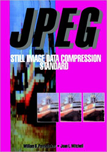

# Photo Debug
This is a .NET C# project that reads the raw CR2 files from CANON cameras.

For the image compression, this book was helpful: [*JPEG: Still Image Data Compression Standard*](http://www.springer.com/us/book/9780442012724)
by Pennebaker, William B., Mitchell, Joan L. 

[](http://www.springer.com/us/book/9780442012724)

## Information:
- [ExifTool by Phil Harvey, Read, Write and Edit Meta Information!](http://www.sno.phy.queensu.ca/~phil/exiftool/)
- [The Canon RAW (CRW) File Format](http://www.sno.phy.queensu.ca/~phil/exiftool/canon_raw.html)
- [ExifPro is an image browser application](https://github.com/mikekov/ExifPro)
- [Understanding What is stored in a Canon RAW .CR2 file, How and Why](http://lclevy.free.fr/cr2/)
- [EXIF MakerNote of Canon](http://www.burren.cx/david/canon.html)
- [JPEG Snoop, File Decoding Utility](http://www.impulseadventure.com/photo/jpeg-snoop.html)
- [Raw Digger](http://www.rawdigger.com/)
- [FastRawViewer is the only WYSIWYG RAW viewer](http://www.fastrawviewer.com/)

## Links:
- [Community Edition of Visual Studio (Free)](https://www.visualstudio.com/vs/community/)
- [Git Extensions (Free)](http://gitextensions.github.io/)
- [ReSharper, Extensions for .NET Developers](https://www.jetbrains.com/resharper/)
- [Amazon](https://www.amazon.com/JPEG-Compression-Standard-Multimedia-Standards/dp/0442012721)
- [Google Books](https://books.google.com/books/about/JPEG.html?id=AepB_PZ_WMkC)

## Sample Code
Here's sample test code to verify the raw image size, from my Canon 7D:
* Sensor Width:  5360 = 1340 * 4 = 2 * 1728 + 1904
* Sensor Height: 3516
* Sensor Precision: 14

```C#
using (var fileStream = File.Open(FileName, FileMode.Open, FileAccess.Read))
using (var binaryReader = new BinaryReader(fileStream))
{
    var rawImage = new RawImage(binaryReader);

    var directory = rawImage.Directories.Last();
    var data = directory.Entries.Single(e => e.TagId == 0x0111).ValuePointer;
    var length = directory.Entries.Single(e => e.TagId == 0x0117).ValuePointer;
    var strips = directory.Entries.Single(e => e.TagId == 0xC640 && e.TagType == 3).ValuePointer;

    binaryReader.BaseStream.Seek(strips, SeekOrigin.Begin);
    var x = binaryReader.ReadUInt16();
    var y = binaryReader.ReadUInt16();
    var z = binaryReader.ReadUInt16();
    Assert.AreEqual(2, x);
    Assert.AreEqual(1728, y);
    Assert.AreEqual(1904, z);

    binaryReader.BaseStream.Seek(data, SeekOrigin.Begin);
    var startOfImage = new StartOfImage(binaryReader, data, length);
    var lossless = startOfImage.StartOfFrame;
    Assert.AreEqual(14, lossless.Precision);
    Assert.AreEqual(4, lossless.Components.Length);
    Assert.AreEqual(1340, lossless.SamplesPerLine);
    Assert.AreEqual(3516, lossless.ScanLines);
}
```

## Author
:fire: [Greg Eakin](https://www.linkedin.com/in/gregeakin)
